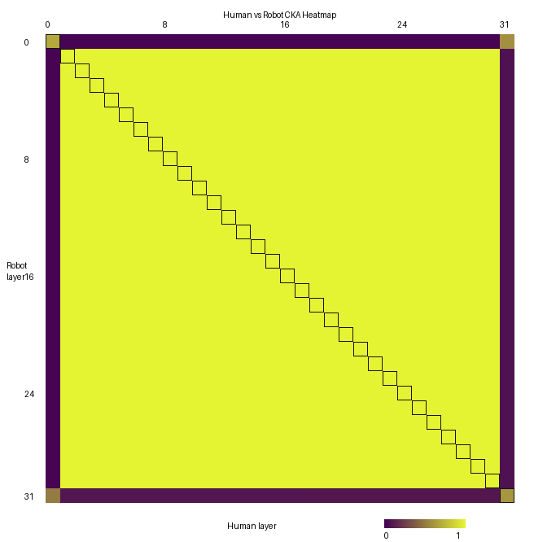

# Human vs Robot CKA Milestone

Sample: `HumanAndRobot / grab_cup_v1 / episode_0 / frame_0`  
Model: `openvla/openvla-7b`  
Comparison: paired robot-camera vs human-camera hidden states

## Result

Centered linear CKA shows very high human/robot alignment through most layers.

- Mean same-layer CKA: `0.978332`
- Lowest layers: layer `31` = `0.614603`, layer `0` = `0.692203`
- Middle layers `1-30`: all `>= 0.999982`
- Tokens used: `274`

## Layer Metrics

| Layer | Same-layer CKA |
|---:|---:|
| 0 | 0.692203 |
| 1 | 0.999999 |
| 2 | 0.999999 |
| 3 | 0.999999 |
| 4 | 0.999998 |
| 5 | 0.999998 |
| 6 | 0.999998 |
| 7 | 0.999997 |
| 8 | 0.999997 |
| 9 | 0.999997 |
| 10 | 0.999996 |
| 11 | 0.999996 |
| 12 | 0.999996 |
| 13 | 0.999995 |
| 14 | 0.999995 |
| 15 | 0.999995 |
| 16 | 0.999994 |
| 17 | 0.999994 |
| 18 | 0.999993 |
| 19 | 0.999993 |
| 20 | 0.999992 |
| 21 | 0.999991 |
| 22 | 0.999991 |
| 23 | 0.999991 |
| 24 | 0.999991 |
| 25 | 0.999991 |
| 26 | 0.999990 |
| 27 | 0.999990 |
| 28 | 0.999988 |
| 29 | 0.999987 |
| 30 | 0.999982 |
| 31 | 0.614603 |

## Interpretation

OpenVLA maps the paired human and robot views into nearly identical internal representations after the first layer. The lower CKA at layer 0 likely reflects camera/viewpoint and embodiment differences; the final-layer drop likely reflects action-specific specialization near the output.

## Caveat

This CKA uses the whole token sequence, including the shared text prompt. The next stronger analysis should split image-token CKA from text-token CKA.

## Takeaway

For this paired H&R sample, OpenVLA shows strong cross-embodiment representational alignment, with most divergence concentrated at the earliest visual layer and final action-oriented layer.
